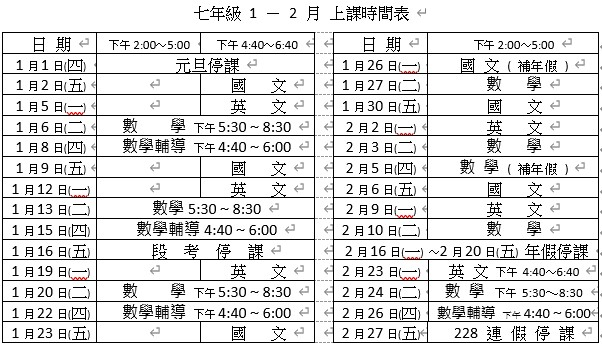
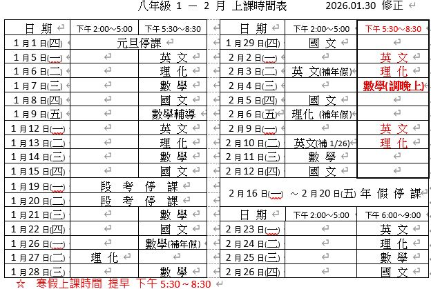
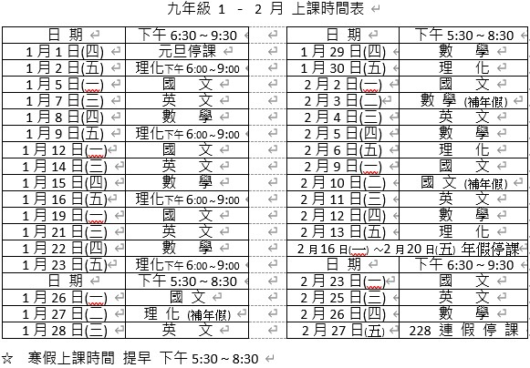

👋 明科補習班 👨‍👩‍👧‍👦  
📚 國小數學 ✨ 國中數學 ✨ 國中英文 ✨ 國中國文 ✨ 國中自然 ✨ 高中數學 ✨ 高中物理 ✨ 高中化學   
🌱 成立於2005年 ，在地經營大直地區 ，歷經多年努力 ，持續幫助學生考取優良成績與好學校 ，成為大直地區成績最好的補習班 🚀   
📞 02-25338966 、📱 0933-910299   
📫 台北市中山區北安路458巷43號   

🌐 明科 [網頁](https://mingker.webnode.tw/)
🚀 明科 [instagram](https://www.instagram.com/mingk2005)
🌟 明科 [Facebook](https://www.facebook.com/MingKer2005)
🎬 明科  [YouTube](https://www.youtube.com/@MingKer2005)

✨ 最佳師資陣容 
- 數學科: 林清池 老師   台灣師範大學   數學系   畢業
- 數學科: 林冠宏 老師   美國 GMU Data Analytics Engineering   大數據碩士   畢業
- 國文科: 施美全 老師   中興大學     法律系   畢業
- 英文科: 李  娜 老師    東吳    英文系  畢業
- 英文科: 陳志忠 老師    輔大  英 文系   畢業
- 自然科: 張    元 老師    台 大  地質科學系碩士   畢業 

7 年級 🔄 時間   

8 年級 🔄 時間   

9 年級 🔄 時間   

7 年級 📜 課程 🙆‍♀️🙆‍♂️🙋‍♀️🙋‍♂️

| 星期 	|             一            	|                二                	|               三               	|             四            	| 五 	|
|:----:	|:-------------------------:	|:--------------------------------:	|:------------------------------:	|:-------------------------:	|:--:	|
| 時間 	| 英  文 🕚 下午4:40~6:40 	| 數  學 🕚 下午5:30~8:30 	| | 數學輔導及英文測驗 🕚 下午4:40~6:00 	| 國  文 🕚 下午4:40~6:40	|

8 年級 📜 課程 🙆‍♀️🙆‍♂️🙋‍♀️🙋‍♂️

| 星期 	|             一            	|                二                	|               三               	|             四            	| 五 	|
|:----:	|:-------------------------:	|:--------------------------------:	|:------------------------------:	|:-------------------------:	|:--:	|
| 時間 	| 英  文 🕚 下午5:30~8:30 	| 自  然 🕚 下午5:30~8:30 	|  數  學 🕚 下午5:30~8:30	| 國  文 🕚 下午5:30~8:30 	| 數學輔導 🕚 下午4:30~5:40 |
 
9 年級 📜 課程 🙆‍♀️🙆‍♂️🙋‍♀️🙋‍♂️

| 星期 	|             一            	|                二                	|               三               	|             四            	| 五 	|
|:----:	|:-------------------------:	|:--------------------------------:	|:------------------------------:	|:-------------------------:	|:--:	|
| 時間 	| 國  文 🕚 下午6:30~9:30 	| | 英  文 🕚 下午6:30~9:30 	| 數  學 🕚 下午6:30~9:30 	|  自  然 🕚 下午6:00~9:00  	|